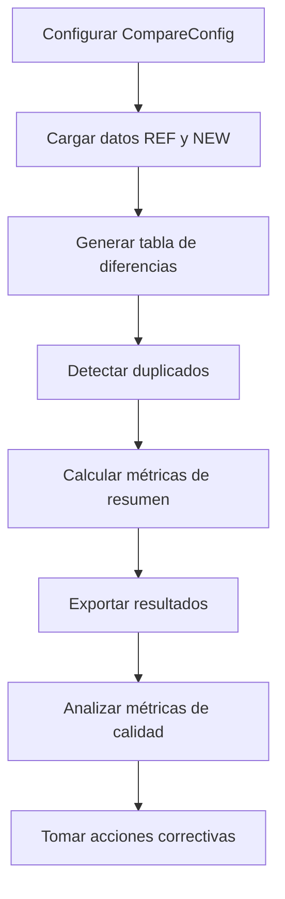

# 🔍 Sistema de Comparación de Tablas - Spark Scala

## 📋 **Descripción Ejecutiva**

Este sistema automatiza la comparación de dos conjuntos de datos (referencia vs nuevo) para identificar:
- **Diferencias** entre registros
- **Duplicados** en ambos conjuntos
- **Métricas de calidad** y cobertura
- **Reportes ejecutivos** en formato tabla y Excel

## 🚀 **Características Principales**

- ✅ **Comparación inteligente** con claves compuestas
- ✅ **Detección automática de duplicados** con variaciones
- ✅ **Métricas de calidad** en tiempo real
- ✅ **Exportación a Excel** para análisis ejecutivo
- ✅ **Soporte para particiones** Hive
- ✅ **Configuración flexible** para diferentes escenarios

---

## 🏗️ **Arquitectura del Sistema**

```
┌─────────────────┐    ┌──────────────────┐    ┌─────────────────┐
│   Datos REF     │    │  Comparación     │    │   Resultados    │
│   (Referencia)  │───▶│   Inteligente    │───▶│   + Métricas    │
└─────────────────┘    └──────────────────┘    └─────────────────┘
         │                       │                       │
         │                       │                       │
         ▼                       ▼                       ▼
┌─────────────────┐    ┌──────────────────┐    ┌─────────────────┐
│   Datos NEW     │    │  Detección de    │    │   Exportación   │
│   (Nuevo)       │    │  Duplicados      │    │   Excel/CSV     │
└─────────────────┘    └──────────────────┘    └─────────────────┘
```

---

## ⚙️ **Configuración Rápida**

### **1. Requisitos del Sistema**
```bash
# Java 8+
# Scala 2.12.18
# Apache Spark 3.5.0
# SBT (Simple Build Tool)
```

### **2. Instalación**
```bash
# Clonar repositorio
git clone <repository-url>
cd CompareTablesSparkScala

# Ejecutar con SBT
sbt compile
sbt run
```

### **3. Scripts de Ejecución**
```bash
# Linux/Mac
./run_compare.sh

# Windows
./run_compare.ps1
```

---

## 🔧 **Configuración del Sistema**

### **CompareConfig - Parámetros Principales**

```scala
val config = CompareConfig(
  spark              = spark,
  refTable           = "default.ref_customers",    // Tabla referencia
  newTable           = "default.new_customers",    // Tabla nueva
  partitionSpec      = Some("date='2025-07-01'"), // Particiones
  compositeKeyCols   = Seq("id"),                 // Claves de comparación
  ignoreCols         = Seq("last_update"),        // Columnas a ignorar
  initiativeName     = "Swift",                   // Nombre iniciativa
  tablePrefix        = "default.result_",         // Prefijo resultados
  checkDuplicates    = true,                      // Detectar duplicados
  includeEqualsInDiff= true,                      // Incluir coincidencias
  autoCreateTables   = true,                      // Crear tablas auto
  exportExcelPath    = Some("./output/summary.xlsx") // Exportar Excel
)
```

---

## 📊 **Salidas del Sistema**

### **1. Tabla de Diferencias** (`result_differences`)

| Campo | Descripción | Ejemplo |
|-------|-------------|---------|
| `id` | Identificador del registro | `1`, `2`, `NULL` |
| `column` | Campo con diferencia | `country`, `amount`, `status` |
| `value_ref` | Valor en referencia | `"US"`, `100.40` |
| `value_new` | Valor en nuevo | `"US"`, `100.40` |
| `results` | Tipo de diferencia | `MATCH`, `NO_MATCH`, `ONLY_IN_REF`, `ONLY_IN_NEW` |

**Tipos de Resultado:**
- **`MATCH`**: Valores idénticos
- **`NO_MATCH`**: Mismo ID, valores diferentes
- **`ONLY_IN_REF`**: Solo existe en referencia
- **`ONLY_IN_NEW`**: Solo existe en nuevo

### **2. Tabla de Duplicados** (`result_duplicates`)

| Campo | Descripción | Ejemplo |
|-------|-------------|---------|
| `origin` | Origen del dato | `REF`, `NEW` |
| `id` | ID del registro | `5`, `NULL` |
| `exact_duplicates` | Duplicados idénticos | `2` |
| `dups_w_variations` | Duplicados con variaciones | `1` |
| `occurrences` | Total de ocurrencias | `3` |
| `variations` | Detalle de variaciones | `amount: [300.00,300.50]` |

### **3. Tabla de Resumen** (`result_summary`)

| Campo | Descripción | Ejemplo |
|-------|-------------|---------|
| `bloque` | Categoría de métrica | `KPIS`, `MATCH`, `NO_MATCH`, `GAP`, `DUPS` |
| `metrica` | Nombre de la métrica | `IDs Uniques`, `1:1 (exact matches)` |
| `universo` | Alcance de la métrica | `REF`, `NEW`, `BOTH`, `ROWS` |
| `numerador` | Valor de la métrica | `10`, `2` |
| `denominador` | Base de cálculo | `13`, `7` |
| `pct` | Porcentaje | `10.0%`, `28.6%` |

---

## 🎯 **Casos de Uso Típicos**

### **1. Control de Calidad de Datos**
```scala
// Configuración para auditoría de calidad
val config = CompareConfig(
  checkDuplicates = true,
  includeEqualsInDiff = false,  // Solo diferencias
  priorityCol = Some("status")  // Columna de prioridad
)
```

### **2. Migración de Datos**
```scala
// Configuración para validación de migración
val config = CompareConfig(
  checkDuplicates = true,
  includeEqualsInDiff = true,   // Incluir coincidencias
  exportExcelPath = Some("./migration_report.xlsx")
)
```

### **3. Reconciliación Financiera**
```scala
// Configuración para reconciliación
val config = CompareConfig(
  compositeKeyCols = Seq("account_id", "transaction_date"),
  ignoreCols = Seq("created_at", "updated_at"),
  checkDuplicates = true
)
```

---

## 📈 **Métricas de Calidad Clave**

### **KPIs Principales**
- **`Quality global`**: Porcentaje de IDs únicos sin duplicados
- **`1:1 exact matches`**: Registros que coinciden perfectamente
- **`Total (NEW-REF)`**: Crecimiento en número de filas

### **Señales de Alerta**
| Métrica | Valor Crítico | Acción |
|---------|---------------|---------|
| Quality global | < 80% | Revisar duplicados en REF |
| 1:1 exact matches | < 50% | Verificar calidad de datos |
| Duplicados total | > 20% | Implementar limpieza |

---

## 🚨 **Solución de Problemas**

### **Error: "Unknown word" en comentarios**
```scala
// ❌ Comentario en español
/**
  * Pruebas complementarias para cubrir switches de configuración
  */

// ✅ Comentario en inglés
/**
  * Additional tests to cover configuration switches
  */
```

### **Error: Particiones no encontradas**
```scala
// Verificar que las particiones existan
val partitionSpec = Some("date='2025-07-01'/geo='ES'")
// Asegurar que las tablas tengan estas particiones
```

### **Error: Memoria insuficiente**
```scala
// Ajustar configuración de Spark
spark.conf.set("spark.sql.shuffle.partitions", "200")
spark.conf.set("spark.executor.memory", "4g")
```

---

## 🔄 **Flujo de Trabajo Típico**



---

## 📁 **Estructura del Proyecto**

```
CompareTablesSparkScala/
├── src/
│   ├── main/scala/
│   │   ├── Main.scala                    # Punto de entrada
│   │   ├── CompareConfig.scala           # Configuración
│   │   ├── TableComparisonController.scala # Controlador principal
│   │   ├── DiffGenerator.scala           # Generador de diferencias
│   │   ├── DuplicateDetector.scala       # Detector de duplicados
│   │   └── SummaryGenerator.scala        # Generador de resumen
│   └── test/scala/                       # Tests unitarios
├── build.sbt                             # Configuración SBT
├── run_compare.sh                        # Script Linux/Mac
├── run_compare.ps1                       # Script Windows
└── output/                               # Resultados exportados
```

---

## 🧪 **Ejecutar Tests**

```bash
# Ejecutar todos los tests
sbt test

# Ejecutar test específico
sbt "testOnly AdditionalSpec"

# Ejecutar con coverage
sbt coverage test coverageReport
```

---

## 📞 **Soporte y Contacto**

Para soporte técnico o preguntas sobre el sistema:
- Revisar los tests en `src/test/scala/`
- Consultar la documentación de Spark SQL
- Verificar logs de ejecución

---

## 📝 **Changelog**

- **v0.1**: Sistema base de comparación
- Soporte para tablas Hive
- Detección de duplicados
- Exportación a Excel
- Métricas de calidad automáticas

---

*Desarrollado con Apache Spark 3.5.0 y Scala 2.12.18*


-----------------------------------------------------------------------------------------------


# 🚀 CompareTables - Resumen Ejecutivo

## 💼 ¿Qué es?

**CompareTables** es una herramienta empresarial que **compara dos conjuntos de datos** y genera **reportes automáticos de calidad**, diferencias y duplicados.

## 🎯 ¿Para qué sirve?

- ✅ **Migraciones de sistemas** - Verificar integridad de datos
- ✅ **Auditorías de calidad** - Medir impacto de limpieza de datos  
- ✅ **Control de cambios** - Detectar modificaciones no autorizadas
- ✅ **Reconciliación** - Alinear información entre sistemas

## 📊 ¿Cómo funciona?

### **Entrada**: 2 Tablas
- **REF**: Datos del sistema anterior/original
- **NEW**: Datos del sistema nuevo/actualizado

### **Salida**: 3 Reportes
1. **Diferencias** - Cambios específicos por campo
2. **Duplicados** - Registros duplicados y variaciones  
3. **Resumen** - KPIs de calidad consolidados

---

## 🔍 Ejemplo Práctico: Clientes

### **Datos de Entrada**
```
REF (Sistema Anterior)          NEW (Sistema Nuevo)
| id | country | amount |       | id | country | amount |
|----|---------|--------|       |----|---------|--------|
| 1  | US      | 100.40 |       | 1  | US      | 100.40 | ← ✅ IDENTICO
| 4  | FR      | 200.00 |       | 4  | BR      | 200.00 | ← ⚠️ COUNTRY DIFERENTE
| 3  | MX      | 150.00 |       | -  | -       | -      | ← ❌ SOLO EN REF
| -  | -       | -      |       | 6  | DE      | 400.00 | ← ❌ SOLO EN NEW
```

### **Reporte de Diferencias**
```
| id | column  | value_ref | value_new | results     |
|----|---------|-----------|-----------|-------------|
| 1  | country | US        | US        | MATCH       | ← ✅ Coincide
| 4  | country | FR        | BR        | NO_MATCH    | ← ⚠️ Diferente
| 3  | country | MX        | -         | ONLY_IN_REF | ← ❌ Solo en REF
| 6  | country | -         | DE        | ONLY_IN_NEW | ← ❌ Solo en NEW
```

### **Reporte de Duplicados**
```
| origin | id | exact_dups | variations | total |
|--------|----|------------|------------|-------|
| REF    | 1  | 1          | 0          | 2     | ← 2 filas idénticas
| NEW    | 4  | 2          | 1          | 4     | ← 2 duplicados + 1 variación
```

### **Reporte de Resumen (KPIs)**
```
| Métrica                    | REF | NEW | %    |
|----------------------------|-----|-----|------|
| IDs Únicos                | 10  | 8   | -    |
| Total Filas               | 13  | 16  | +23% |
| Matches Exactos           | -   | -   | 29%  |
| Solo en REF               | -   | -   | 30%  |
| Solo en NEW               | -   | -   | 13%  |
| Calidad Global            | -   | -   | 10%  |
```

---

## 🎯 Interpretación de Resultados

### **✅ MATCH (29%)**
- IDs que existen en ambos sistemas con **valores idénticos**
- **Bueno**: Datos consistentes entre sistemas

### **⚠️ NO_MATCH (71%)**  
- IDs que existen en ambos pero con **valores diferentes**
- **Revisar**: Posibles errores de migración o cambios intencionales

### **❌ ONLY_IN_REF (30%)**
- IDs que **solo existen** en el sistema anterior
- **Peligroso**: Datos perdidos en la migración

### **❌ ONLY_IN_NEW (13%)**
- IDs que **solo existen** en el nuevo sistema
- **Revisar**: Datos nuevos o duplicados

### **🔍 DUPLICADOS**
- **Exactos**: Filas idénticas (pueden eliminarse)
- **Con variaciones**: Mismo ID, valores diferentes (requieren revisión)

---

## 💡 Beneficios Empresariales

| Área | Beneficio |
|------|-----------|
| **Riesgo** | ✅ Detección temprana de problemas de datos |
| **Calidad** | ✅ Métricas cuantificables de integridad |
| **Eficiencia** | ✅ Automatización de auditorías manuales |
| **Compliance** | ✅ Evidencia documentada de migraciones |
| **Costos** | ✅ Reducción de errores y re-trabajos |

---

## 🚀 Casos de Uso Reales

### **🏦 Sector Bancario**
- Migración de core banking
- Reconciliación de cuentas
- Auditoría de transacciones

### **🏥 Sector Salud**
- Migración de historiales médicos
- Validación de datos de pacientes
- Control de medicamentos

### **🏭 Sector Industrial**
- Migración de sistemas ERP
- Control de inventarios
- Validación de facturación

---

## 🔧 Tecnología

- **Lenguaje**: Scala (JVM)
- **Procesamiento**: Apache Spark (Big Data)
- **Almacenamiento**: Hive + Parquet
- **Exportación**: Excel automático
- **Escalabilidad**: Millones de registros

---

## 📞 Uso

```bash
# Ejecutar comparación completa
./run_compare.sh

# Resultados en Hive + Excel
```

**Tiempo de procesamiento**: Minutos para millones de registros
**Formato de salida**: 3 tablas Hive + 1 archivo Excel
**Configuración**: Archivo de configuración simple

